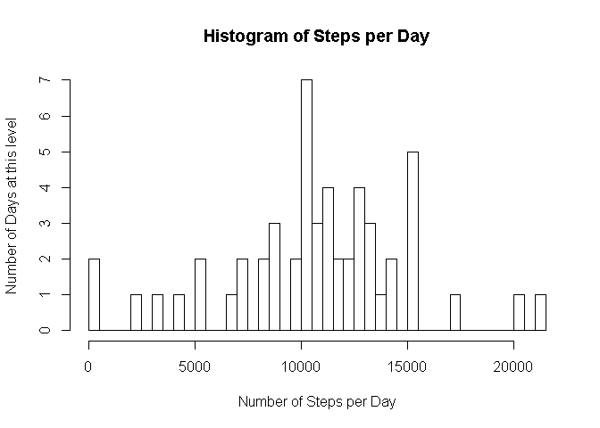
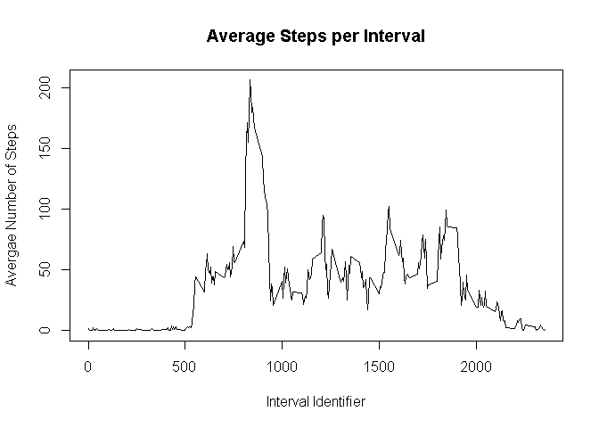
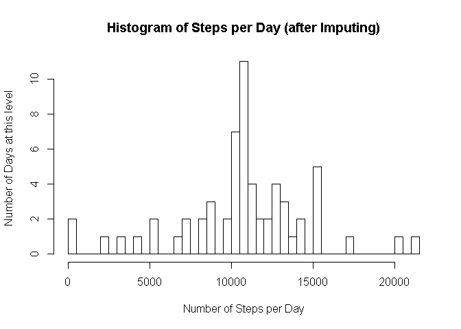
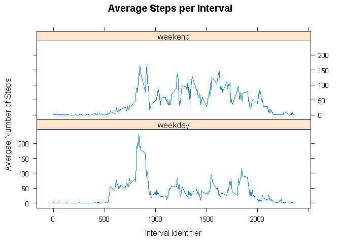

# Reproducible Research: Peer Assessment 1


## Loading and preprocessing the data

```r
#specify that results should be shown in the printed document
setwd("~/GitHub/BBrepo/RepData_PeerAssessment1/activity")
#create a data frame from the input file
act=read.csv("activity.csv")
# create a subset with no missing values
actGood=act[complete.cases(act),]
#print the total number of steps
print(paste("The total number of steps is",toString(sum(actGood$steps))))
```

[1] "The total number of steps is 570608"

## What is mean total number of steps taken per day?

```r
# List the unique days that have actual data
# (leaves out days that have no data)
actDays=unique(actGood$date)
#For each day, computer the total number of steps taken
daySteps=sapply(actDays,function(x) sum(actGood[actGood$date==x,1]))
print(paste("The mean of the total number of steps taken per day is", toString(mean(daySteps))))
```

[1] "The mean of the total number of steps taken per day is 10766.1886792453"

```r
print(paste("The median of the total number of steps taken per day is", toString(median(daySteps))))
```

[1] "The median of the total number of steps taken per day is 10765"

```r
hist(daySteps,breaks=length(daySteps), xlab="Number of Steps per Day", ylab="Number of Days at this level", main="Histogram of Steps per Day")
```

 

## What is the average daily activity pattern?

```r
# Caalculate the average number of steps in eacch five miute
# averaged across all days

# First make a list of the five-minute intervals that we have data for
# Make sure they are in order so the plot is done correctly later
uniqueInterval=sort(unique(actGood$interval))
# For each interval, calculate the mean across all days
avgIntervalSteps=sapply(uniqueInterval,
                function(x) mean(actGood$steps[actGood$interval==x]))
# create a time series from the averages
actTS=ts(avgIntervalSteps, start=0, frequency = 5)
# Put the interval identifiers as the x axis and the means as the y axis
plot(x=uniqueInterval,y=actTS,type="l",xlab="Interval Identifier",
     ylab="Avergae Number of Steps",main="Average Steps per Interval")
```

 

```r
print(paste("The identifier of the 5-minute interval, on average across all the days in the dataset,
            that contains the maximum number of steps is",
            toString(uniqueInterval[avgIntervalSteps==max(avgIntervalSteps)])))
```

[1] "The identifier of the 5-minute interval, on average across all the days in the dataset,\n            that contains the maximum number of steps is 835"


## Imputing missing values

```r
print(paste("The number of rows with missing values is",
            toString(length(act$steps)-length(actGood$steps))))
```

[1] "The number of rows with missing values is 2304"

```r
# Get the indices of the rows where the steps are Not Available
toFill=is.na(act$steps)
#List the interval identifiers for the intervals with missing steps
fillIntervals = act$interval[toFill]
#Set up a new data frame and
#fill in the steps values with the average steps corresponding to those interval identifiers
newact=data.frame(act)
newact$steps[toFill]=sapply(fillIntervals, function(x) avgIntervalSteps[uniqueInterval==x])

newactDays=unique(newact$date)
newdaySteps=sapply(newactDays,function(x) sum(newact[newact$date==x,1]))
print(paste("The mean of the total number of steps taken per day is", toString(mean(newdaySteps))))
```

[1] "The mean of the total number of steps taken per day is 10766.1886792453"

```r
print(paste("The median of the total number of steps taken per day is",
            toString(median(newdaySteps))))
```

[1] "The median of the total number of steps taken per day is 10766.1886792453"

```r
hist(newdaySteps,breaks=length(newdaySteps), xlab="Number of Steps per Day", ylab="Number of Days at this level", main="Histogram of Steps per Day (after Imputing)")
```

 

No, the mean and the median do not significantly differ from the estimates
from the first part of the assignment.
The impact of imputing missing data on the estimates of the total daily number of steps, is:
- there are more days with steps
- there is an increase in the highest numbers of steps per day
- there is an increase in the number of days with the highest steps

## Are there differences in activity patterns between weekdays and weekends?


```r
# Prepare to match the name of a day against whether it is a weekday or weekend
dayOfWeek=c("Monday","Tuesday","Wednesday", "Thursday","Friday","Saturday","Sunday" )
dayType=c(rep("weekday",5),rep("weekend",2))
#For each row in the dataframe, set a factor in a new column, indicating the day type
newact$dayType=factor(dayType[match(weekdays(as.Date(newact$date)),dayOfWeek)])

#Now create a new data frame that has the average steps per interval by day type
#The columns will be interval, steps, dayType
actWdayType=data.frame(uniqueInterval)
actWdayType$steps=sapply(actWdayType$uniqueInterval,
                function(x) mean(newact$steps[newact$interval==x & newact$dayType=="weekday"]))
actWdayType$dayType="weekday"
#Create a second data frame based on weekend instead of weekday,
#then append to the first data frame
actWdayType2=data.frame(uniqueInterval)
actWdayType2$steps=sapply(actWdayType$uniqueInterval,
                function(x) mean(newact$steps[newact$interval==x & newact$dayType=="weekend"]))
actWdayType2$dayType="weekend"
actWdayType = rbind(actWdayType2,actWdayType)
actWdayType$dayType = as.factor(actWdayType$dayType)
rm(actWdayType2)
# Use the lattice library to plot in panels by factor
library(lattice)
xyplot(actWdayType$steps~actWdayType$uniqueInterval|actWdayType$dayType,type="l",
     xlab="Interval Identifier",
     ylab="Avergae Number of Steps",main="Average Steps per Interval",
     layout=c(1,2))
```

 
